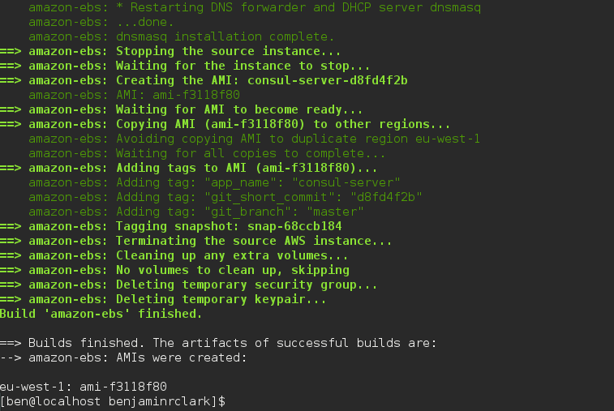

# cluster-scripts
Scripts for cluster management

These scripts are to demonstrate how to set up a cluster with two toy-microservices running in it using a scheduler ([Nomad](https://nomadproject.io) and service discovery ([Consul](https://consul.io)). 

I'm doing this to find out for myself:

 * Are there any advantages in running apps like this over just running them in using golden images?

 * And what does it mean when we're developing applications - do we have to do something new?

 * Finally, how do we collaborate when we're developing and deploying apps and infrastructure?

## The Components

We're going to deploy two proper services - one imaginatively called *frontend* and one called *backend*. Backend s a simple ruby app which returns some JSON. The JSON includes some which are read from the environment. 

Frontend is another ruby app which does the same thing - it reads some values from the environment and displays them as HTML. But in this case, makes a request to the backend service first and displays the values from the backend service too. The first thing which is different is that we can't rely on knowing the location of the backend service when frontend is deployed and we can't rely on it staying the same over time either. Instead, we'll register instances which provide the backend service with a service registry (Consul) and then the frontend service can look up the location from consul before it makes a request to the backend service.

To expose this all to the outside world, we would typically register our Amazon EC2 Instance with an Elastic Load Balancer. But this isn't going to work in a world where services come and go all the time. So we need something else in between. Here we're using [Traefik](https://traefik.io), which is a reverse proxy which can load it's configuration from consul and reconfigure itself on the fly. Traefik is also run using nomad, but as a system job (on every frontend box) and with a known port. This means that we can run multiple copies of traefik for redundancy and to balance load, and use the ELB for high availabilty.

All of these services are going to run in some shared *infrastructure* which consists of three parts. The first module creates a Virtual Private Cloud, with the kind of networking components (subnets, internet gateway, nat gateways, bastion host) which everything else runs in. Secondly we create three servers which run consul and nomad in server mode. These servers will be responsible for holding the state of the cluster between them. Finally we create an autoscaling group of worker nodes which run consul and nomad agents. These nodes automatically register themselves with the cluster as they come and go, and are responsible for running the jobs.

## The Build

As well as trying out consul and nomad for the first time, I'm interested in how they integrate with Hashicorp's other tools, so we're going to use [packer](https://packer.io) to do the building. We need to build two Amazon Machine Images, one for the consul / nomad server, and one for the consul / nomad worker. We also need to build two docker containers, one for the *frontend* and one for the *backend* application. All of the components have their own github repo and have a common layout

 * `dev/` contains a Vagrantfile which will create a development environment for the project
 * `build/` contains a packer file (packer.json) which will build either an AMI or a docker container
 * `infra/` contains terraform files which will build the infrastructure for the project. In most cases, we're using shared infrastructure, so the terraform files reference the shared infrastructure rather than duplicating it
 * `deploy/` contains an erb template for a nomad job file which we can use to run the job

I've made some shell scripts to that can be used to build the images and containers (*build.sh* using packer), then create the infrastructure (*plan.sh* and *apply.sh* using terraform), and then finally run the jobs (*run.sh* and *stop.sh*). They assume you have packer, terraform, consul and nomad in your path (on your development machine), plus some other common programmes (like ssh, git, curl and jq). They also assume that there are some environmental variables set which tell them the information they need.

In addition to an account with AWS and a docker repository (e.g. dockerhub, Amazon Elastic Container Registry), to make full use of traefik, you need a [Route53 hosted zone](https://aws.amazon.com/route53/) 

Varible               | Description
----------------------|-------------
AWS_ACCESS_KEY_ID     | Your AWS Access Key ID
AWS_SECRET_ACCESS_KEY | Your AWS Secret Access Key
AWS_DEFAULT_REGION    | The region where you want to run your infrastructure
DOCKER_REPOSITORY     | The docker repository you're using to store your containers
DOCKER_LOGIN          | Whether you need to login to your docker repostory (true or false)
DOCKER_EMAIL          | Your docker email
DOCKER_USERNAME       | Your docker username
DOCKER_PASSWORD       | Your docker password
REMOTE_STATE_BUCKET   | The name of the S3 bucket where you're storing the remote state of your infrastructure
ENVIRONMENT           | The name for the environment you're creating (e.g. int, test, prod)
CONSUL_SERVER_AMI     | The AMI of the consul server
NOMAD_WORKER_AMI      | The AMI of the nomad worker
ROUTE_53_ZONE_ID      | The identifier of your route53 hosted zone
DOMAIN_NAME           | The domain name of your route53 hosted zone

1. First, we need to build the machine images for the consul servers and workers. If you've checked out everything into the same directory, then from that directory run `cluster-scripts/build.sh module-consul-nomad` and `cluster-scripts/build.sh module-nomad-workers`

 
